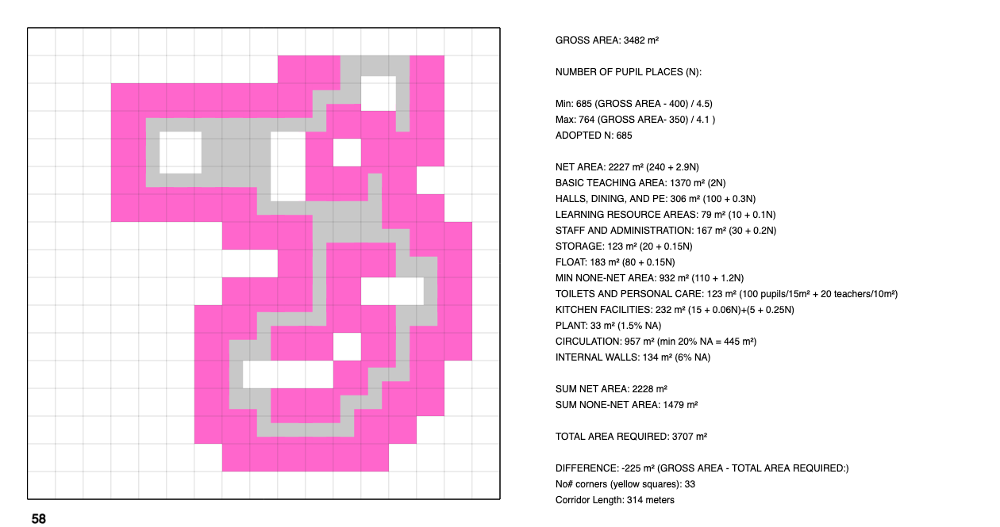

# SafeSchoolCA

CA-based generator for school buildings layouts: enhancing resilience to targeted violence utilizing Cellular Automata (CA).

## How to Run the Code?

All code is stored in `safe_school_ca.js`. In order to run it and visualize the generated layouts, please open `index.html`. 
